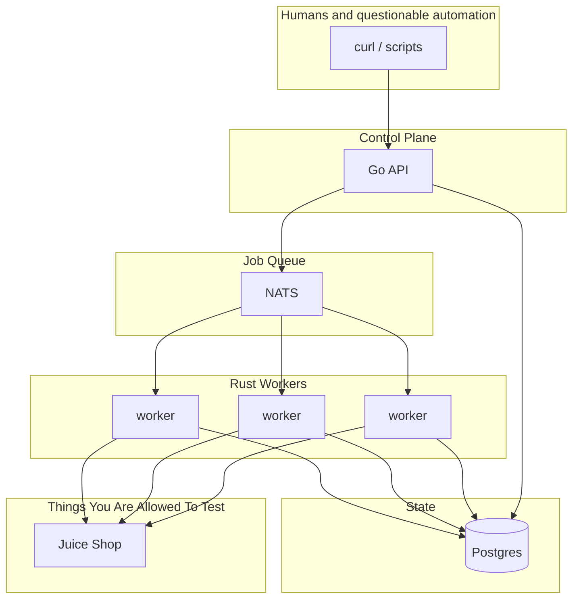
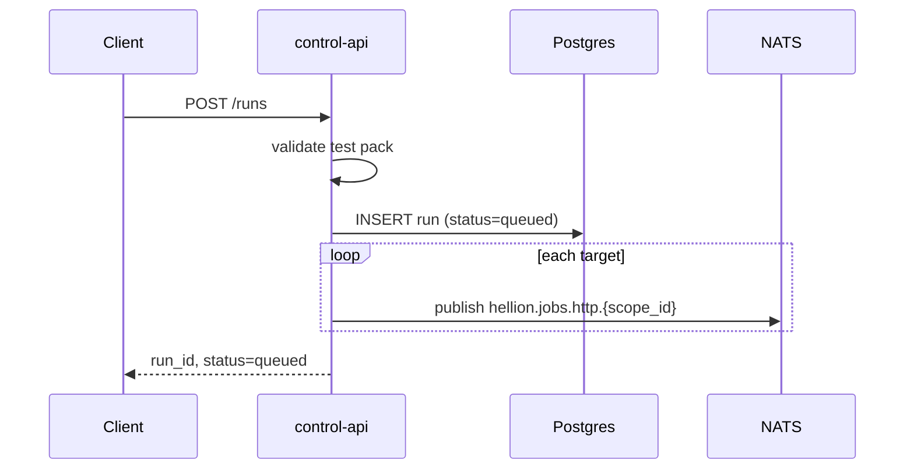
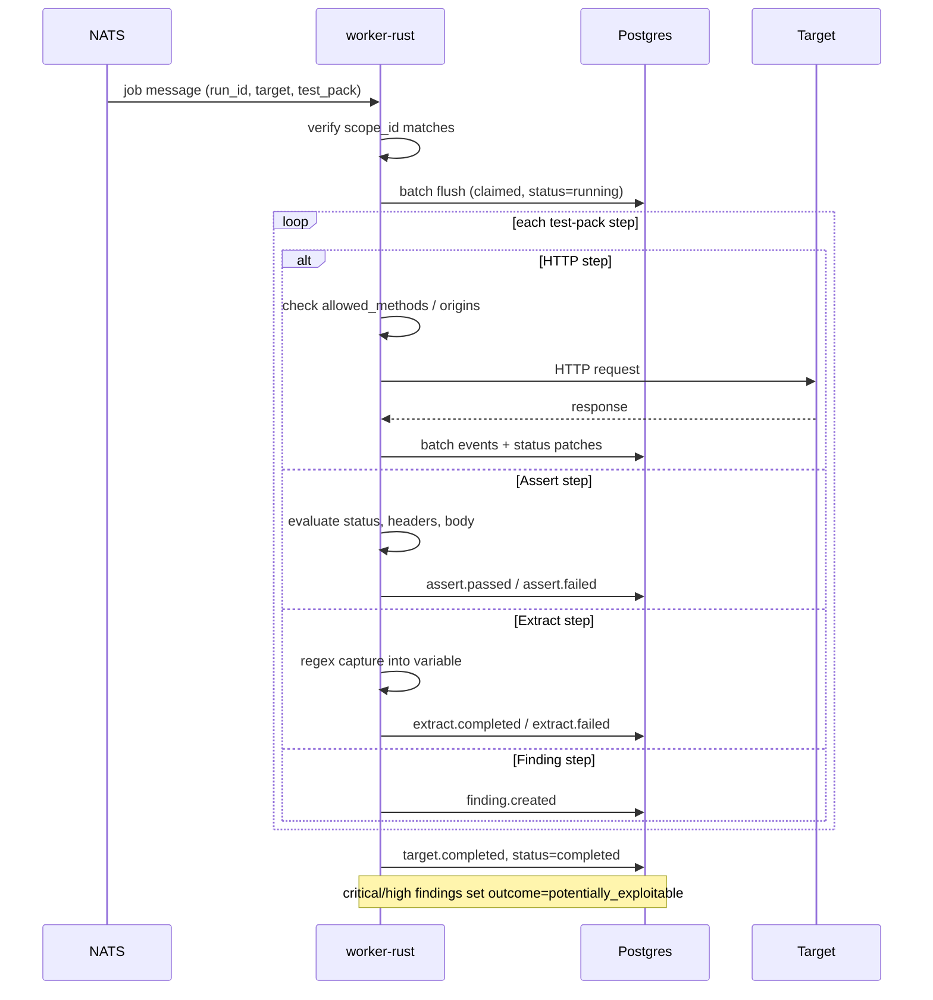
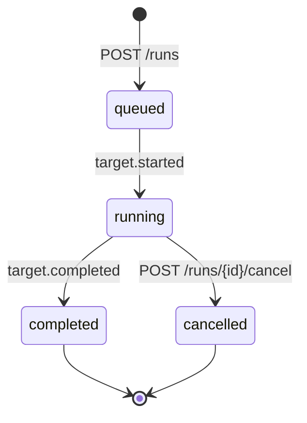

# Hellion Architecture

Component overview and operational flows for the default docker-compose stack.

## Overview

| Component | Role |
|-----------|------|
| **control-api** | REST API and embedded web UI |
| **worker-rust** | Executes test packs; enforces scope; batches state writes to Postgres |
| **NATS** | Distributes jobs to workers (`hellion.jobs.http.{scope_id}`) |
| **Postgres** | Run metadata, event history, aggregated stats |

## Run creation

Run IDs are UUID v4 values prefixed with `run_`, e.g. `run_550e8400-e29b-41d4-a716-446655440000`.

## Worker execution

Workers batch Postgres writes: status updates flush immediately; events are bulk-inserted when the buffer fills or the job completes.

## Run lifecycle

## Related docs

| Guide | Description |
|-------|-------------|
| [API guide](./api.md) | Endpoints, request/response shapes |
| [Performance guide](./performance.md) | Benchmarks, bottlenecks, tuning |
| [Test packs guide](./test-packs.md) | Writing HTTP check workflows |
