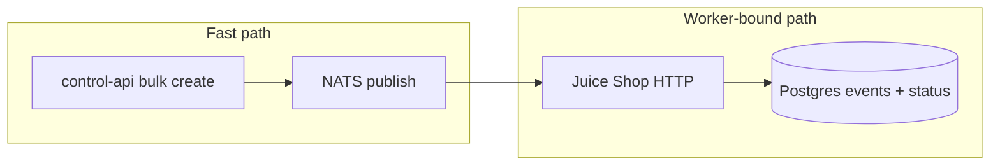

# Hellion Performance Guide

Benchmark results and tuning notes for the default docker-compose stack targeting OWASP Juice Shop with the `juice-shop-detect` test pack.

## Test setup

| Component | Configuration |
|-----------|---------------|
| Target | `http://juice-shop:3000` |
| Test pack | `juice-shop-detect` (1 HTTP GET + 2 asserts + 1 finding) |
| Scope | `local-juice-shop`, concurrency **25** per worker |
| Worker env | `BENCHMARK_MODE=false`, `HELLION_VERBOSE_EVENTS=false`, `STATE_BATCH_SIZE=64`, `PG_POOL_SIZE=12` |
| Postgres | `max_connections=300`, `shared_buffers=256MB` |
| Benchmark script | `tests/bench.sh` |
| Poll endpoint | `GET /runs/stats` (aggregated counts, not full run list) |

Each run creates one Postgres row and a small set of high-signal events (`finding.created`, `target.completed`, errors). State updates use batched `UNNEST` inserts and split patch/event flushes.

## Running benchmarks

```bash
# Start the stack
docker compose up -d --build

# Default: 1000 runs
./tests/bench.sh

# Custom run count and timeout
RUNS=10000 TIMEOUT_SEC=600 ./tests/bench.sh

# From inside the compose network
API=http://control-api:8080 RUNS=1000 ./tests/bench.sh
```

The script reports three metrics:

| Metric | Measures |
|--------|----------|
| **Queue time** | Bulk create via `POST /runs/bulk` until all run records exist |
| **Worker time** | First poll after queue until `completed == RUNS` |
| **Total time** | Queue + worker (end-to-end) |

## Reference results

Measured on Windows 11 host, Docker Desktop, single `worker-rust` replica unless noted. Results vary with CPU, worker replica count, and Juice Shop load.

### Summary

| Runs | Queue (ms) | Worker (ms) | Total (ms) | Queue rate | Worker rate | Total rate |
|------|------------|-------------|------------|------------|-------------|------------|
| 100 | 76 | 292 | 423 | 1,316/s | 342/s | 236/s |
| 1,000 | 73 | 865 | 994 | 13,699/s | 1,156/s | 1,006/s |
| 10,000 | 168 | 3,892 | 4,122 | 59,524/s | 2,569/s | 2,426/s |
| 100,000 | 1,020 | 43,782 | 44,870 | 98,039/s | 2,284/s | 2,229/s |

### Observations

**Queue path scales well.** Bulk insert via `pgx.Batch` and NATS publish keeps queue throughput above 60k runs/sec even at 10k runs.

**Worker throughput plateaus around 2.2–2.6k runs/sec** with one worker at concurrency 25. The bottleneck shifts from HTTP (Juice Shop) to Postgres event writes as run volume grows.

**Tail latency grows at 100k.** Progress is steady until ~68k completed, then completion rate slows as the target and database contend. The run still finishes within the default 300s timeout when Postgres connection limits are configured correctly.

**Earlier stalls (fixed).** Runs stuck at 99.6% were caused by Postgres `max_connections=100` being exceeded when multiple worker replicas each opened large connection pools. Current compose sets `max_connections=300` and `PG_POOL_SIZE=12` per worker.

## Architecture and bottlenecks



| Stage | Typical limit | Notes |
|-------|---------------|-------|
| Bulk queue | 60k–100k runs/sec | Postgres batch insert + NATS flush |
| NATS delivery | Very high | Queue group `hellion-http-workers` |
| HTTP requests | Target-dependent | Juice Shop saturates under heavy parallel load |
| Postgres writes | ~2–3k runs/sec | Event batching + patch-only flushes for status |

## Tuning

### Worker throughput

| Variable | Default | Effect |
|----------|---------|--------|
| `worker_concurrency` (scope YAML) | 25 | Max parallel jobs per worker process |
| `BENCHMARK_MODE` | `false` | `true` skips event inserts; fastest mode |
| `HELLION_VERBOSE_EVENTS` | `false` | `true` stores every event; significantly slower |
| `STATE_BATCH_SIZE` | 64 | Events flushed in bulk when buffer fills |
| `PG_POOL_SIZE` | 12 | Connections per worker; keep `replicas × PG_POOL_SIZE < max_connections` |

Scale workers horizontally:

```bash
docker compose up -d --scale worker-rust=4
```

With 4 replicas at concurrency 25, theoretical parallelism is 100 in-flight jobs. Size Postgres accordingly:

```
max_connections >= (worker_replicas × PG_POOL_SIZE) + headroom for control-api
```

### Postgres

```yaml
postgres:
  command: ["postgres", "-c", "max_connections=300", "-c", "shared_buffers=256MB"]
```

Increase `max_connections` and `shared_buffers` when scaling workers or raising concurrency.

### Modes

| Mode | Events stored | Use case |
|------|---------------|----------|
| `BENCHMARK_MODE=true` | No | Peak throughput, load testing |
| `HELLION_VERBOSE_EVENTS=false` | High-signal only | Production-like benchmarks |
| `HELLION_VERBOSE_EVENTS=true` | All events | Debugging, full audit trail |

Example compose override for peak benchmark throughput:

```yaml
worker-rust:
  environment:
    BENCHMARK_MODE: "true"
    HELLION_VERBOSE_EVENTS: "false"
```

Example for full event capture (slower):

```yaml
worker-rust:
  environment:
    BENCHMARK_MODE: "false"
    HELLION_VERBOSE_EVENTS: "true"
    STATE_BATCH_SIZE: "128"
```

## Monitoring during a run

Poll aggregated status (cheap):

```bash
curl http://localhost:8080/runs/stats
```

Example response:

```json
{"queued":0,"running":12,"completed":9988,"cancelled":0,"failed":0,"total":10000}
```

Watch worker logs for flush errors:

```bash
docker compose logs -f worker-rust
```

## Related scripts

| Script | Purpose |
|--------|---------|
| `tests/bench.sh` | Queue + worker end-to-end benchmark |
| `tests/queue-only.sh` | Measure bulk queue speed only |
| `tests/e2e.sh` | Functional correctness (single run) |

## API reference

- [API guide](./api.md) — includes `GET /runs/stats`
- [OpenAPI spec](./openapi.yaml)
