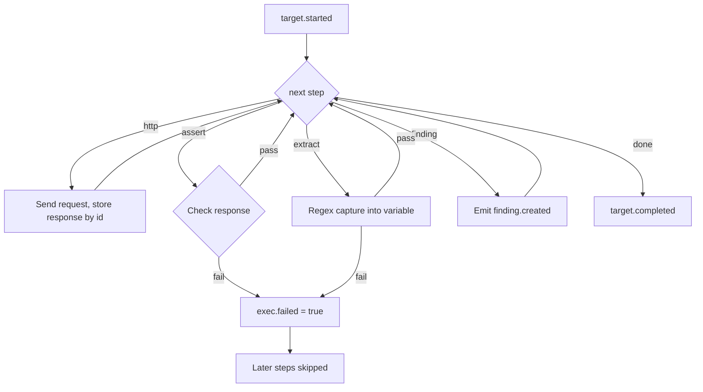

# Writing Test Packs

Test packs are YAML files that describe a multi-step HTTP check against a target. Workers load them at startup from `/app/test-packs/` and execute steps sequentially for each job.

## File layout

```
test-packs/
├── juice-shop-detect.yaml
├── http-rich-test.yaml
├── csrf-flow-test.yaml
└── headers-basic.yaml
```

Each file must define:

| Field | Required | Description |
|-------|----------|-------------|
| `id` | yes | Unique identifier; used in API `test_pack` field (filename without `.yaml`) |
| `name` | yes | Human-readable label emitted in events |
| `steps` | yes | Ordered list of step objects |

The control API validates that `id` and `steps` exist when a run is created.

Reference a pack by filename stem:

```bash
curl -X POST http://localhost:8080/runs \
  -H "Content-Type: application/json" \
  -d '{
    "scope_id": "local-juice-shop",
    "targets": ["http://juice-shop:3000"],
    "test_pack": "juice-shop-detect"
  }'
```

## Step types

Steps are a discriminated union — each list item has exactly one top-level key:

| Key | Purpose |
|-----|---------|
| `http` | Send an HTTP request and store the response |
| `assert` | Check a stored response |
| `extract` | Capture a value from a response into a variable |
| `finding` | Record a security finding |

```yaml
steps:
  - http:
      id: root
      method: GET
      path: /

  - assert:
      response: root
      status: 200
      message: Homepage returned 200

  - finding:
      severity: critical
      message: Vulnerable application detected
```

## Execution model



- Steps run **in order** for each target.
- HTTP responses are stored by `id` and referenced by later `assert` / `extract` steps.
- If `exec.failed` is set (failed assert or extract), remaining steps emit `step.skipped` but the run still completes.
- HTTP request errors emit `request.error` but do **not** set `exec.failed` — later steps still run unless an assert fails.
- Redirects are disabled; the worker follows the initial response only.

## HTTP step

```yaml
- http:
    id: api_probe          # required — response handle for later steps
    method: POST           # required — GET, POST, HEAD, etc.
    path: /rest/user/login # required — joined to job target URL
    timeout_ms: 5000       # optional — per-request timeout
    headers:               # optional
      Accept: application/json
    query:                 # optional — URL query parameters
      q: search
    form:                  # optional — application/x-www-form-urlencoded
      email: test@example.com
      password: secret
    json:                  # optional — application/json body
      email: test@example.com
      password: secret
    body: "raw string"     # optional — raw request body
```

### URL construction

`path` is joined to the job `target` (e.g. `http://juice-shop:3000` + `/api` → `http://juice-shop:3000/api`).

The final URL must match an entry in the worker scope `allowed_origins`. The HTTP method must be listed in `allowed_methods`.

### Variable interpolation

Strings in `method`, `path`, `headers`, `query`, `form`, `body`, and `json` support `{{ variable }}` or `{{variable}}` substitution from prior `extract` steps:

```yaml
- extract:
    response: login_page
    from: body
    regex: 'name="_token" value="([^"]+)"'
    into: csrf_token

- http:
    id: login_attempt
    method: POST
    path: /login
    form:
      _token: "{{ csrf_token }}"
      email: test@example.com
```

## Assert step

```yaml
- assert:
    response: root        # required — id from a prior http step
    message: Check passed # required — emitted on pass/fail
    severity: high        # optional — default info; used on failure
```

All configured checks must pass. Available conditions (combine as needed):

| Field | Pass condition |
|-------|----------------|
| `status` | Status code equals value |
| `status_lt` | Status code is less than value |
| `status_gte` | Status code is greater than or equal to value |
| `status_not` | Status code is not equal to value |
| `header_present` | Header exists (case-insensitive) |
| `header_absent` | Header does not exist |
| `header_contains` | Header value contains substring |
| `body_contains` | Response body contains substring |
| `body_not_contains` | Response body does not contain substring |

Header checks example:

```yaml
- assert:
    response: home
    header_absent: content-security-policy
    severity: medium
    message: Missing Content-Security-Policy header

- assert:
    response: api_probe
    header_contains:
      name: content-type
      value: application/json
    message: Login API returns JSON
```

On failure the worker emits `assert.failed`, sets `exec.failed`, and skips subsequent steps (except the final `target.completed`).

## Extract step

```yaml
- extract:
    response: login_page  # required — id from a prior http step
    from: body            # body | header
    regex: 'token=([^&]+)'  # required — must have capture group 1
    into: session_token   # required — variable name for later steps
```

- `from: body` searches the response body.
- `from: header` searches a flattened `name: value` header dump.
- The regex **must include a capture group** `(...)`. Group 1 is stored in `into`.
- On failure emits `extract.failed` and sets `exec.failed`.

## Finding step

```yaml
- finding:
    severity: critical   # info | low | medium | high | critical
    message: OWASP Juice Shop detected
```

Findings emit `finding.created` with the given severity and message.

Run outcome is affected by severity:

| Severity | Run outcome |
|----------|-------------|
| `critical` or `high` | `potentially_exploitable` |
| Other | No outcome change |

If no critical/high finding is emitted, the run outcome defaults to `not_exploitable` on completion.

## Complete examples

### Detection pack

[`test-packs/juice-shop-detect.yaml`](../../test-packs/juice-shop-detect.yaml)

```yaml
id: juice-shop-detect
name: Detect OWASP Juice Shop

steps:
  - http:
      id: root
      method: GET
      path: /

  - assert:
      response: root
      status: 200
      message: Homepage returned 200

  - assert:
      response: root
      body_contains: "OWASP Juice Shop"
      message: Body contains Juice Shop fingerprint

  - finding:
      severity: critical
      message: OWASP Juice Shop detected
```

### JSON API probe

[`test-packs/http-rich-test.yaml`](../../test-packs/http-rich-test.yaml) — POST with JSON body, status and header checks, SQL error leak detection.

### CSRF token flow

[`test-packs/csrf-flow-test.yaml`](../../test-packs/csrf-flow-test.yaml) — GET page, extract token, POST form with interpolated variable.

### Security headers

[`test-packs/headers-basic.yaml`](../../test-packs/headers-basic.yaml) — checks for missing CSP and X-Frame-Options.

## Scope constraints

Workers enforce scope rules before sending requests:

```yaml
# scopes/local-juice-shop.yaml
scope_id: local-juice-shop
allowed_origins:
  - http://juice-shop:3000
allowed_methods:
  - GET
  - HEAD
```

A request is blocked with `scope.blocked` when:

- The resolved URL origin does not match `allowed_origins`
- The method is not in `allowed_methods`

Ensure your test pack only uses methods and paths reachable within the active scope.

## Events emitted

| Event | When |
|-------|------|
| `worker.job.claimed` | Job picked up |
| `target.started` | Test pack execution begins |
| `request.sent` | HTTP request dispatched |
| `request.completed` | HTTP response received |
| `request.error` | Request failed (timeout, DNS, invalid method) |
| `assert.passed` | Assertion succeeded |
| `assert.failed` | Assertion failed |
| `extract.completed` | Variable extracted |
| `extract.failed` | Extraction failed |
| `finding.created` | Finding recorded |
| `step.skipped` | Step skipped after prior failure |
| `scope.blocked` | Request blocked by scope |
| `target.completed` | All steps finished |

Set `HELLION_VERBOSE_EVENTS=false` on workers to store only high-signal events. Set `BENCHMARK_MODE=true` to skip event storage entirely while still updating run status.

## Tips

1. **Name HTTP steps clearly** — `id` values are the API between steps; keep them short and unique within a pack.
2. **One concern per assert** — smaller asserts produce clearer failure messages.
3. **Use `status_not: 500`** for API probes where any non-error response is acceptable.
4. **Put findings last** — record conclusions after checks pass.
5. **Match filename to `id`** — use `my-pack.yaml` with `id: my-pack` so `test_pack: my-pack` resolves predictably.
6. **Test locally** — mount `./test-packs` into control-api and worker containers (default in docker-compose) and run a single target before benchmarking.

```bash
./tests/e2e.sh
```

## Related docs

- [API guide](./api.md) — creating runs with `test_pack`
- [Performance guide](./performance.md) — benchmark throughput
- [OpenAPI spec](./openapi.yaml)
