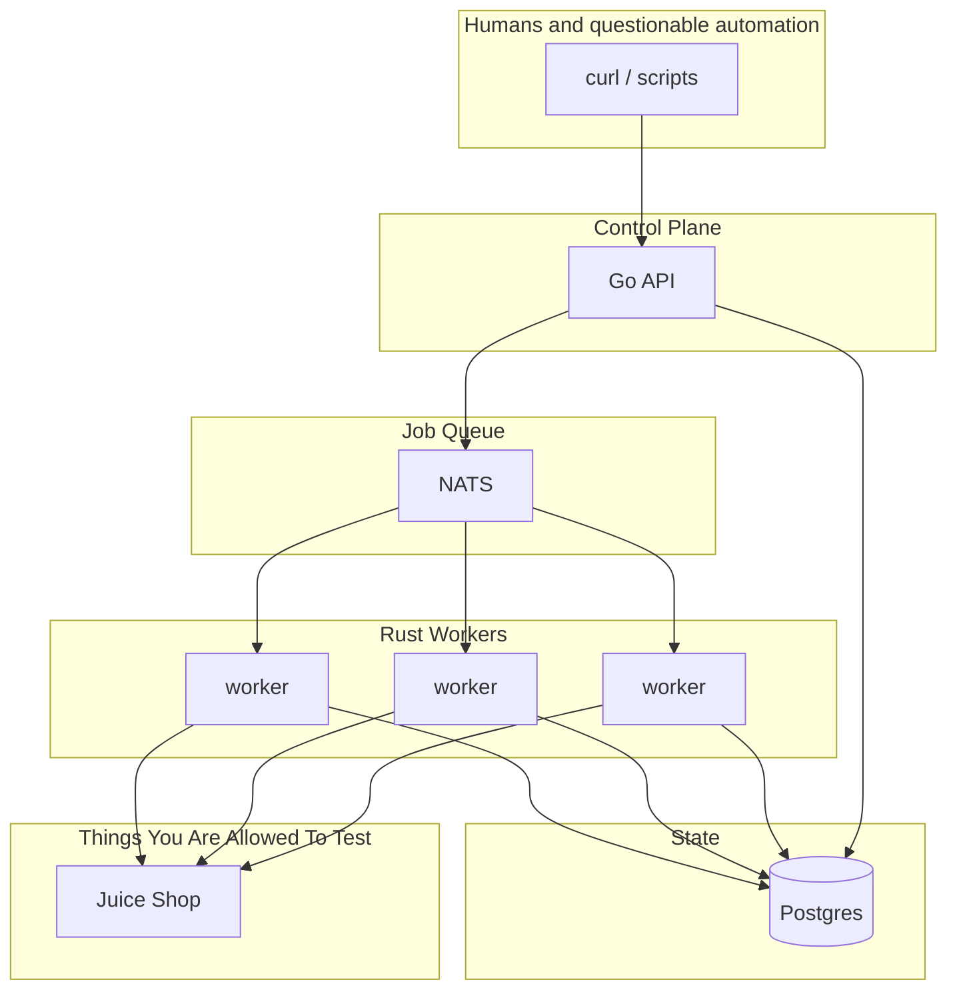
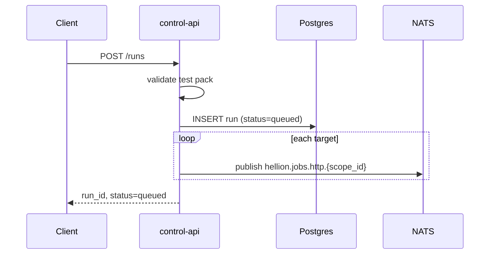
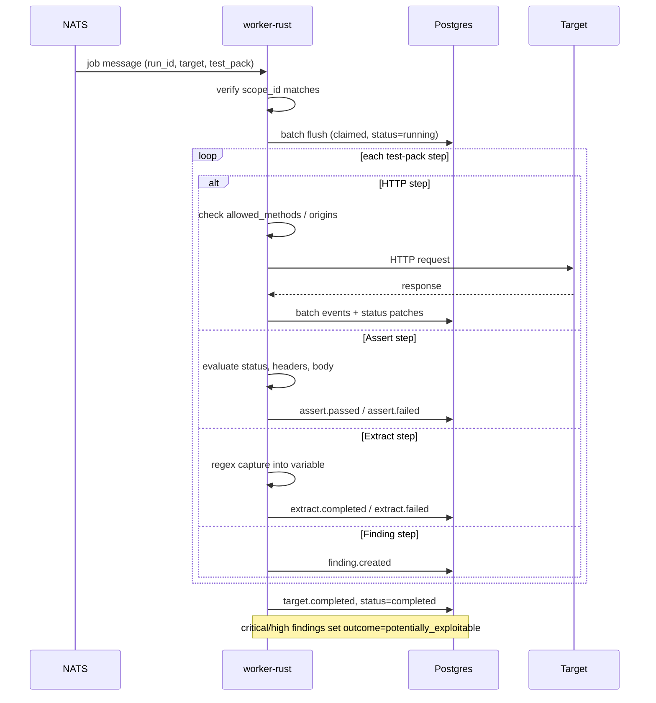
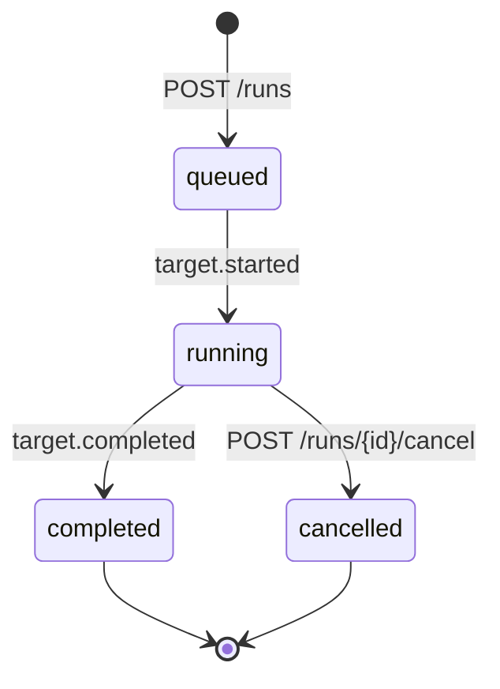

[](.github/images/logo.png)

# Hellion
> What if Burp, Nuclei and Postgres had an ugly late night hookup behind a Greggs? 

</br>

- No AI.
- No blockchain.
- No microservice named after a Greek god.
- Just werxs good n fast

| Runs | Queue (ms) | Worker (ms) | Total (ms) | Queue rate | Worker rate | Total rate |
|------|------------|-------------|------------|------------|-------------|------------|
| 100 | 76 | 292 | 423 | 1,316/s | 342/s | 236/s |
| 1,000 | 73 | 865 | 994 | 13,699/s | 1,156/s | 1,006/s |
| 10,000 | 168 | 3,892 | 4,122 | 59,524/s | 2,569/s | 2,426/s |
| 100,000 | 1,020 | 43,782 | 44,870 | 98,039/s | 2,284/s | 2,229/s |

## Architecture



| Component | Role |
|-----------|------|
| **control-api** | REST API |
| **worker-rust** | Does the work |
| **NATS** | Distributes jobs to worker |
| **Postgres** | Run metadata, event history, aggregated stats |

## Operational flow

### Run creation



Run IDs are UUID v4 values prefixed with `run_`

### Worker execution



### Run lifecycle



## Quick start


### Start shit

```bash
docker compose up --build
```

Open **http://localhost:8080** for the web UI (same port as the API).

### Throw shit

```bash
curl -X POST http://localhost:8080/runs \
  -H "Content-Type: application/json" \
  -d '{
    "scope_id": "local-juice-shop",
    "targets": ["http://juice-shop:3000"],
    "test_pack": "juice-shop-detect"
  }'
```

### Read shit

```bash
curl http://localhost:8080/runs/stats
curl http://localhost:8080/runs/{run_id}
curl http://localhost:8080/runs/{run_id}/events
```

## Config

### Scopes

Scopes live in `scopes/` and are mounted into workers at `/app/scopes/`

```yaml
scope_id: local-juice-shop
allowed_origins:
  - http://juice-shop:3000
allowed_methods:
  - GET
  - HEAD
max_rps: 0
worker_concurrency: 25
```

| Field | Description |
|-------|-------------|
| `scope_id` | Matches NATS subject and job `scope_id` |
| `allowed_origins` | Base URLs workers may request |
| `allowed_methods` | HTTP methods permitted |
| `max_rps` | Per-worker rate limit (0 = unlimited) |
| `worker_concurrency` | Concurrent jobs per worker |

Set `SCOPE_PATH` on the worker to point at the scope file.

### Test packs

Test packs live in `test-packs/` as YAML files, duh. [READ THIS](.github/docs/test-packs.md). Each pack is made of steps:

| Step type | Purpose |
|-----------|---------|
| `http` | Send a request (method, path, headers, body, JSON, form) |
| `assert` | Check status, headers, or body of a named response |
| `extract` | Capture a regex group into a variable |
| `finding` | Record a finding |

Example (`test-packs/juice-shop-detect.yaml`):

```yaml
id: juice-shop-detect
name: Detect OWASP Juice Shop
steps:
  - http:
      id: root
      method: GET
      path: /
  - assert:
      response: root
      status: 200
      message: Homepage returned 200
  - finding:
      severity: critical
      message: OWASP Juice Shop detected
```


### Environment variables

**control-api**

| Variable | Default | Description |
|----------|---------|-------------|
| `NATS_URL` | `nats://nats:4222` | NATS connection URL |
| `DATABASE_URL` | postgres DSN | Postgres connection for runs and events |

**worker-rust**

| Variable | Default | Description |
|----------|---------|-------------|
| `NATS_URL` | `nats://nats:4222` | NATS connection URL |
| `DATABASE_URL` | postgres DSN | Postgres connection for batched state writes |
| `SCOPE_PATH` | `/app/scopes/local-juice-shop.yaml` | Scope file path |
| `HELLION_VERBOSE_EVENTS` | `false` | Store all events vs. high-signal only |
| `BENCHMARK_MODE` | `false` | Skip event inserts (status updates still written) |
| `STATE_BATCH_SIZE` | `64` | Events per Postgres bulk flush |
| `PG_POOL_SIZE` | `12` | Connections per worker (`replicas × PG_POOL_SIZE < max_connections`) |

Scale workers horizontally:

```bash
docker compose up -d --scale worker-rust=4
```

## Documentation

| Guide | Description |
|-------|-------------|
| [API guide](.github/docs/api.md) | Endpoints, run lifecycle, events |
| [Test packs guide](.github/docs/test-packs.md) | Writing HTTP check workflows |
| [Performance guide](.github/docs/performance.md) | Benchmarks and tuning |
| [OpenAPI spec](.github/docs/openapi.yaml) | Machine-readable API schema |

## Project layout

```
Hellion/
├── control/           # Go Control API + embedded web UI (control/web/)
├── worker/            # Rust job worker
├── scopes/            # Worker scope definitions
├── test-packs/        # YAML test pack definitions
├── tests/             # e2e, benchmark, and queue scripts
├── docker-compose.yml
└── .github/docs/      # API, test pack, and performance docs
```

## Testing and benchmarks

```bash
# End-to-end functional test
bash tests/e2e.sh

# Queue throughput only (no wait for completion)
RUNS=50 bash tests/queue-only.sh

# Full benchmark: queue + worker completion (polls GET /runs/stats)
RUNS=1000 TIMEOUT_SEC=300 ./tests/bench.sh
```

Set `API=http://control-api:8080` when running scripts from inside the compose network. Override `RUNS` and `TIMEOUT_SEC` for larger or longer benchmarks. See the [performance guide](.github/docs/performance.md) for reference throughput and tuning.

## Development

### Build locally

```bash
# Worker
cd worker && cargo build

# Control API
cd control && go build .
```

### Rebuild containers

```bash
docker compose build worker-rust control-api
docker compose up -d
```
